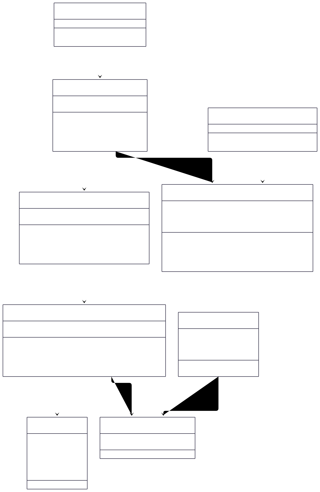
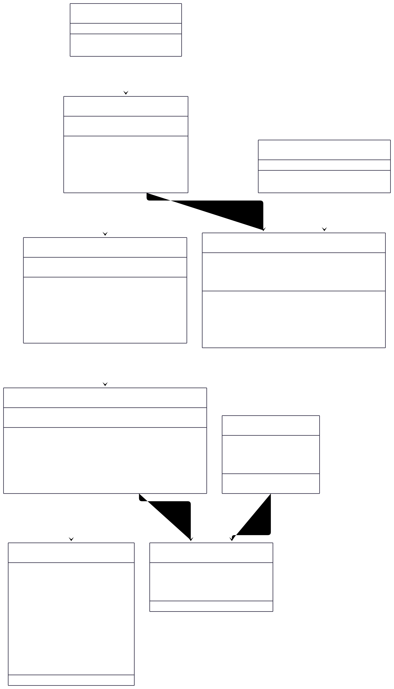
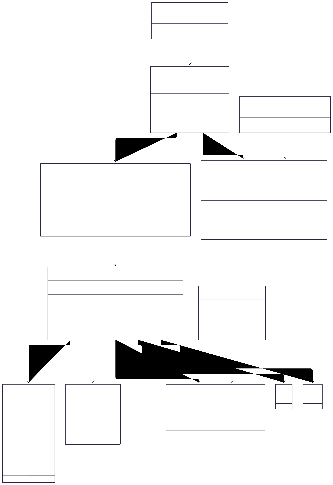
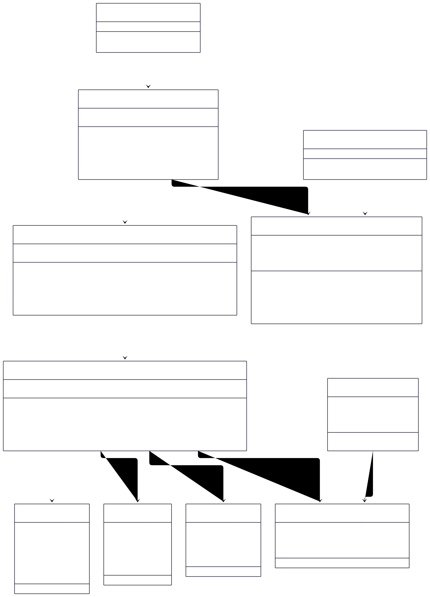
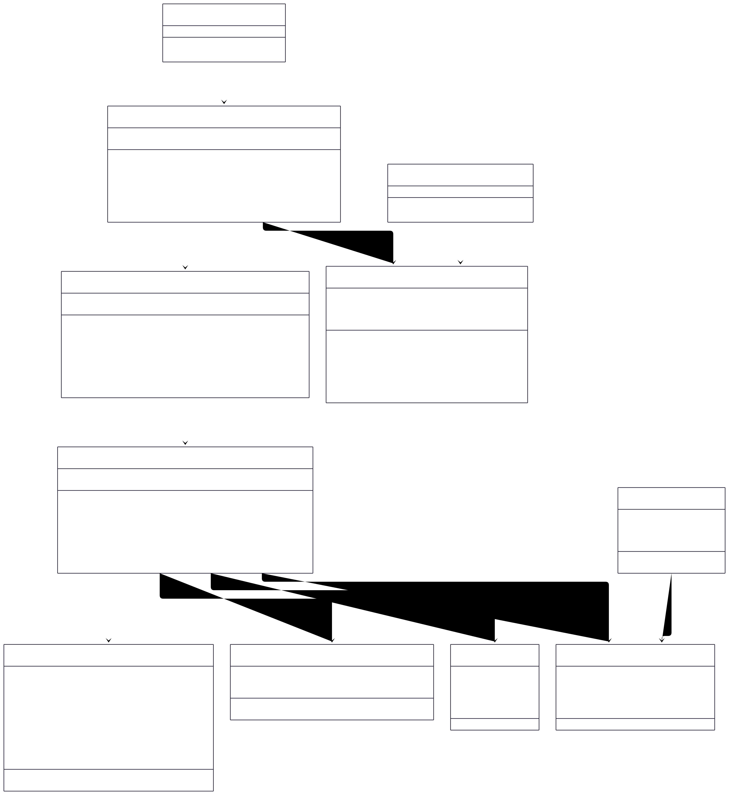
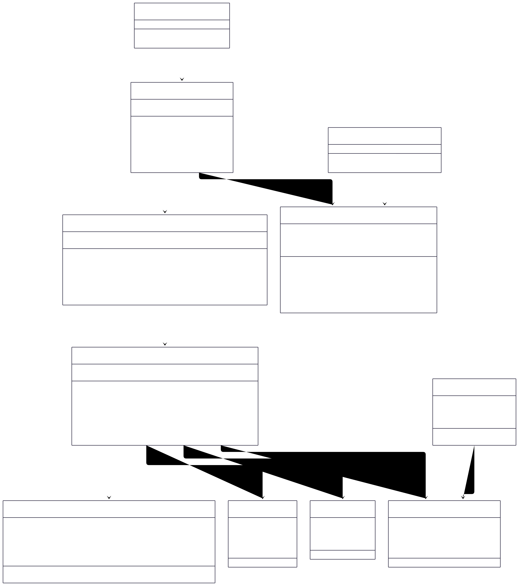
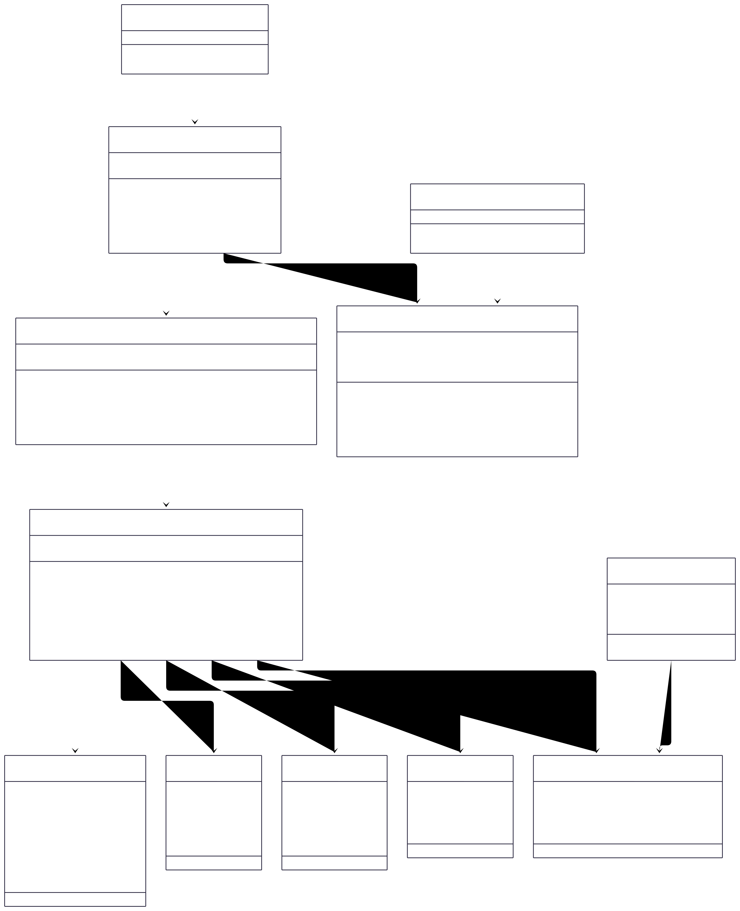

## 2.4 Abstração e Implementação

### 2.4.1 Visão Lógica

Seguindo a estrutura de Cliente-Servidor em construção de software MonoRepo, temos a seguinte visão lógida do software:

> Estrutura Macro

O projeto é estuturado em monorepo, com gerenciamento feito pelo `PNPM` e possui otimização pelo Turborepo, com diferenciação entra FrontEnd e BackEnd.

A raíz do projeto possui o arquivo pnpm-workspace.yaml, que define:

- `apps/*` contendo as aplicações executáveis do aplicativo móvel e API
- `packages/*` contendo as configurações compartilhadas como Linters, Configs de testes e outros, usados pela aplicação em apps.

> Módulos Principais

A pasta `apps/` possui os componentes principais do sistema:

### a) O módulo `apps/api`

É o módulo de API do backend do Projeto, constituído em Node.js com TypeScript

- O Framework utiliza **Express.JS** e **ExpoRouter** para roteamento e gerenciamento de requisições.
- O **Banco de dados** utiliza o **Prisma** `(Prisma/schema.prisma)` para se comunicar com o banco de dados **Postgres.SQL**, rodando a partir de um container do **DOCKER**.
- A **estrutura de módulos**: A API é organizada por _features_ como visto em `src/modules/user` e `src/modules/auth` e cada módulo contém: `routes.ts` para definir endpoints da API, `controllers.ts` para orquestrar a lógica de requisição, `services.ts` contendo a lógica de negócios. `repository.ts` que abstrai o acesso direto ao banco de dados do **Prisma**.
- Os **testes de API** são configurados com o **JEST** e estáo na pasta `src/__tests__`, com foco em testes de integração e testes unitários.

### b) Módulos FrontEnd `apps/mobile`

É o aplicativo móvel principal, desenvolvido com **REACT NATIVE** e **EXPO**.

- **Roteamento**: É feito através do **ExpoRouter**, com uma abordagem _file based routing_ em que a estrutura de diretórios define a rota de navegaçõa do app.
- `(Auth)`: Define a tela de autenticação como: `login.tsc` e `cadastro.tsx`.
- `(Dashboard)`: Define a área logada do aplicativo, e possui páginas como (`Home.tsx` e `Teams.tsx`).
- **Componentização**: O sistema está organizado com uma pasta dedicada a **componentes reutilizáveis** em (`components/`).
- **Estilização e temas**: São definidos por designs (`constants/Colors.ts` e `constants/Fonts.ts` e `constants/Theme.ts`).
- Os **Testes**: são encontrados na pasta (`__tests__/`) e utilizam o **JEST** (com o React Native Testing Library) para testar componentes e páginas (`components/` e `paginas/`)

### C) Módulos Compartilhados (packages)

O diretório packages é fundamental para a estratégia do monorepo, garantindo que todas as apps sigam os mesmos padrões de qualidade de código:

- `packages/eslint-config`: Configuração base do ESLint, compartilhada entre api e mobile.

- `packages/jest-config`: Presets de configuração do Jest.

- `packages/prettier-config`: Regras de formatação de código (Prettier).

- `packages/typescript-config`: Arquivos tsconfig.json base, garantindo consistência nas configurações do TypeScript.

  > Diagrama UML:

<em>Figura 2.4.1 - Diagrama de pacotes UML</em>

<em>Fonte: <a href="https://github.com/osamuelleite">Samuel Leite</a></em>

O diagrama de classes em alto nível representa a estrutura lógica do backend, destacando a separação entre camada de lógica de negócio e camada de persistência.

Na parte superior do fluxo estão as classes App e Server, responsáveis pela configuração e inicialização da aplicação, incluindo o registro das rotas e middlewares globais. As rotas direcionam as requisições HTTP para os Controllers, que são os pontos de entrada da lógica de negócio.

A classe Controller representa a camada de controle, responsável por receber as requisições, acionar as validações (via middlewares e schemas Zod) e encaminhar as operações à camada de serviço.
A Service implementa a lógica de negócio, verificando regras como unicidade de email, autenticação e consistência dos dados. Ela não acessa o banco diretamente, para isso utiliza a Repository.

A Repository representa a camada de persistência, responsável por consultar, criar, atualizar e excluir dados no banco através do PrismaClient, que é o ORM usado para interagir com o banco de dados relacional. Assim, o repositório isola o acesso ao banco, permitindo que a lógica de negócio permaneça independente da tecnologia de persistência.

As classes Validation e Middlewares aparecem como suporte transversal, garantindo a validação dos dados, autenticação e tratamento padronizado de erros. A classe ApiError centraliza a forma como exceções são propagadas e tratadas, mantendo consistência nas respostas de erro.

Em resumo, o diagrama mostra uma arquitetura em camadas bem definidas:

- Controller: interface entre a API e a lógica de negócio.

- Service: regras e operações do domínio.

- Repository: acesso e manipulação de dados persistentes.

- PrismaClient: integração direta com o banco, cliente ORM responsável pela execução das queries no Postgres

- Middlewares e ApiError padronizam validação e tratamento de erros.

Essas camadas interagem de forma sequencial: Controller → Service → Repository → Banco de Dados, com middlewares e validações atuando de forma transversal. Essa estrutura favorece organização, testabilidade e manutenção do sistema.

<em>Figura 2.4.2 - Diagrama de classes - User</em>

<em>Fonte: <a href="https://github.com/LasagnaIsLove">Gabriel Mota</a></em>

- UserController: expõe endpoints REST (createUser, getUserById, updateUser, deleteUser). Recebe requisições, aplica validações com o ValidateRequestMiddleware e delega a lógica ao UserService. Em caso de erro, lança ApiError.

- UserService: contém as regras de negócio (ex.: impedir e-mail duplicado, validar permissões de atualização/exclusão). Utiliza o UserRepository para acessar o banco e lança ApiError em casos de violação de regras.

- UserRepository: responsável pela persistência via PrismaClient. Executa operações CRUD (create, findById, update, delete) e consultas específicas. Isola o acesso ao banco, mantendo o service independente da tecnologia usada.

- User (modelo de domínio): representa os dados do usuário: id, name, userName, email, createdAt, updatedAt. Pode incluir campos adicionais como profileType.

<em>Figura 2.4.3 - Diagrama de classes - Group</em>

<em>Fonte: <a href="https://github.com/LasagnaIsLove">Gabriel Mota</a></em>

-  GroupController: entrada das requisições REST para grupos, aplica validação (middleware) e delega para o service.

- GroupService: contém lógica de domínio (ex.: garantir unicidade de nome, checar permissões do ownerId, regras de groupType), não acessa o DB diretamente.

- GroupRepository: camada de persistência, encapsula consultas e comandos ao Prisma (prisma.group.*) e retorna objetos Group (tipados conforme o MER do projeto).

<em>Figura 2.4.4 - Diagrama de classes - Post</em>

<em>Fonte: <a href="https://github.com/LasagnaIsLove">Gabriel Mota</a></em>

- PostController: é o ponto de entrada das requisições HTTP, valida o request (via middleware Zod), extrai contexto de autenticação e delega ao PostService. Não contém lógica de negócio além do roteamento e preparação de respostas.

- PostService: centraliza as regras de negócio do domínio Post:

  - valida permissões (por exemplo, só admins do groupId podem publicar eventos),

  - garante regras específicas de postType (se `EVENTO`, exige eventDate e possivelmente location),

  - orquestra ações compostas (criar post + notificar membros, atualizar caches, etc.),

  - lança ApiError para erros de negócio (404, 403, 400).

- PostRepository: abstrai o acesso ao banco, traduz chamadas da camada de serviço em operações do ORM (`prisma.post.create/findUnique/findMany/update/delete`) e faz joins/queries relacionadas (ex.: buscar comments, contar likes, listar posts de um group). Aqui também fica a lógica de persistência de relacionamentos N:M (postLikes) e operações que afetam múltiplas tabelas (recomendável usar transações do Prisma nesses casos).

<em>Figura 2.4.5 - Diagrama de classes - Comment</em>

<em>Fonte: <a href="https://github.com/LasagnaIsLove">Gabriel Mota</a></em>

- CommentController: recebe as requisições HTTP relacionadas a comentários (criar, listar por post, obter, atualizar, excluir). Aplica validações via middleware (Zod) e extrai contexto de autenticação antes de delegar à camada de serviço.

- CommentServic: contém a lógica de negócio dos comentários, validações específicas (ex.: post existe, usuário não está banido do grupo), autorização (só autor ou moderador pode editar/excluir), regras de formatação/normalização (ex.: sanitização do content) e orquestra chamadas a repositórios e possíveis side-effects (notificações, incrementos de contadores). Em caso de violação de regra, lança ApiError. Essa separação mantém regras de domínio fora do controller. (baseado na visão lógica e MER do projeto).

- CommentRepository: encapsula a persistência com Prisma, mapeia DTOs para `prisma.comment.create/findUnique/findMany/update/delete`. Também resolve associações (trazer autor, ou contar comentários do post) e é o local apropriado para usar transações quando operações afetam múltiplas tabelas (ex.: criar comentário + atualizar contador de comentários no post). O modelo entidade-relacionamento define a relação 1:N entre Post e Comment e 1:N entre User e Comment, que o repositório materializa nas queries.

<em>Figura 2.4.6 - Diagrama de classes - Match</em>

<em>Fonte: <a href="https://github.com/LasagnaIsLove">Gabriel Mota</a></em>

- MatchController: ponto de entrada HTTP para operações relacionadas a partidas (criar, listar, atualizar, excluir, inscrever usuário). As rotas aplicam validação (middleware Zod) e autenticação, e só orquestram chamadas ao serviço.

- MatchService: contém a lógica de negócio da entidade Match:

  - valida regras do domínio (por exemplo: limites de participantes, regras de horário, somente organizador pode finalizar/editar placar),

  - verifica permissões (quem pode criar/editar/excluir),

  - orquestra ações compostas (criar partida + criar 2 Team como entidades fracas, notificar inscritos),

  - usa transações quando necessário (criar Match e Team em uma operação atômica),

- MatchRepository: abstrai acesso ao banco via PrismaClient (delegate match, team, tabela de participantes N:M). Implementa queries: findById, findMany (com joins para times/participantes), addParticipant/removeParticipant (N:M), update e delete. É aqui que se usa prisma.$transaction(...) quando múltiplas tabelas precisam ser alteradas de forma atômica (ex.: adicionar participante e incrementar contadores).

- Domain Model: Match guarda metadados da partida (times referenciais, data, local, placar, criador). Team é uma entidade fraca ligada a Match que relaciona userId a um time (home/away) e modela a composição 1:2 descrita no MER. Usuários podem se inscrever em Matches (N:M), essa inscrição é representada por uma tabela de ligação (e gerenciada pelo repositório).

<em>Figura 2.4.7 - Diagrama de classes - Teams</em>

<em>Fonte: <a href="https://github.com/LasagnaIsLove">Gabriel Mota</a></em>

A entidade Team é uma entidade fraca ligada a uma Match (cada Match tem dois Teams: home e away). Um Team relaciona usuários (membros) àquela equipe, isso pode ser modelado como array de userId ou, preferivelmente, por uma tabela N:M team_members.

- TeamController: Expondo endpoints REST (criar time, adicionar/remover membro, listar times de uma partida, atualizar, excluir). Recebe requests validados por middleware (Zod) e contexto de autenticação; delega a lógica ao service.

- TeamService: Contém regras de negócio como, quem pode criar/alterar times (ex.: só o organizador da Match), limites de membros por time, verificação de conflito (usuário não pode estar em dois times da mesma Match), e decisão de usar transação quando uma operação altera múltiplas tabelas (por exemplo, ao adicionar membro: inserir em team_members + atualizar contador em team ou match). Em violações de regras lança ApiError.

- TeamRepository: Faz o mapeamento para o banco (Prisma): prisma.team.create, prisma.team.update, prisma.teamMembers.create / delete, prisma.team.findMany com where: { matchId } e includes para membros. Operações compostas que alteram team e a tabela de membros devem ser feitas via prisma.$transaction(...) para garantir atomicidade.

- Modelo de dados: Team armazena metadados (role, referência a matchId) enquanto a associação team_members materializa os membros (teamId, userId). Essa separação facilita consultas (listar membros, checar inscrições) e mantém normalização.

<em>Figura 2.4.8 - Diagrama de classes - Report</em>

<em>Fonte: <a href="https://github.com/LasagnaIsLove">Gabriel Mota</a></em>

- ReportController: expõe endpoints REST (criar, listar, obter, atualizar status, excluir). Aplica validação (Zod) e autenticação via middlewares, e limita-se a orquestrar chamadas aos serviços.

- ReportService: concentra regras de negócio, por exemplo: garantir que targetPostId ou targetCommentId seja informado (mas não ambos), validar que o alvo existe, impedir denúncias duplicadas do mesmo usuário sobre o mesmo alvo, definir status inicial (OPEN) e decidir side-effects (notificar moderadores). Em violações de regras lança ApiError.

- ReportRepository: encapsula a persistência com Prisma (prisma.report.create/findUnique/findMany/update/delete) e traz queries específicas (relatórios por alvo, contagem de denúncias por post/comment). Operações que afetam múltiplas tabelas (ex.: criar report + marcar post como under_review) devem usar transação (prisma.$transaction) aqui.

- Integração com Post/Comment/User: um Report referencia um Post ou um Comment (1:N do alvo para reports) e sempre referencia o reporter (User). O repositório resolve essas associações ao devolver o objeto Report com includes quando solicitado (por exemplo, include do reporter e do target para a interface administrativa).

## 2.4.2 Visão de Dados (MER)

O Modelo Entidade-Relacionamento (MER) do sistema foi desenvolvido para representar de forma clara e estruturada as entidades principais, seus atributos e os relacionamentos entre elas. Este modelo serve como base para a criação do esquema do banco de dados relacional, garantindo que os dados sejam armazenados de maneira eficiente e consistente.

<em>Figura 2.4.9 - Modelo Entidade-Relacionamento (MER) do Sistema</em>

<em>Fonte: <a href="https://github.com/CODEbugging3000">Gabriel Alves</a></em>

O MER inclui as seguintes entidades principais:

- **User (Usuário):** Representa os usuários do sistema, com atributos principais como ID, nome, userName, email e senha, ProfileType (tipo de perfil).
- **Group (Grupo):** Representa grupos de usuários, com atributos como ID, nome, bio, groupType (tipo de grupo que pode ser ATLÉTICA ou AMADOR).
- **Post (Publicação):** Representa as publicações feitas pelos usuários admins de grupos, contendo atributos como ID, title, content (conteúdo), date_of_post (data e hora da publicação), postType (tipo de publicação que pode ser EVENTO ou GERAL), location e event_date opcionais para eventos.
- **Comment (Comentário):** Representa os comentários feitos pelos usuários nas publicações, com atributos como ID, content (conteúdo) e createdAt (data e hora do comentário).
- **Match (Partida):** Representa partidas esportivas organizadas por grupos, com atributos como ID, home_team (time da casa), away_team (time visitante), match_date (data e hora da partida), location (local) e score_home e score_away para o placar.
- **Teams (Times):** Entidade fraca que representa os times associados as partidas, com apenas um atributo userId.
- **Report (Denúncia):** Representa denúncias feitas por usuários contra publicações ou comentários, com atributos como ID, reason (motivo) e createdAt (data e hora da denúncia).

Os relacionamentos entre as entidades são definidos para refletir as interações e dependências do sistema, como a associação entre usuários e grupos, publicações e comentários, e partidas e times. Foram identificados os tipos de relacionamentos (1:1, 1:N, N:M) e as cardinalidades para garantir a integridade dos dados.

Os relacionamentos principais incluem:

- Um **User** pode pertencer a muitos **Groups** (N:M), e um **Group** pode ter muitos **Users**.
- Um **User** pode seguir **(Follow)** muitos **Groups** (N:M), e um **Group** pode ser seguido por muitos **Users**.
- Um **User** pode criar muitas **Posts** (1:N), e cada **Post** é criado por um único **User** desde que seja um admin de um **Group**.
- Um **Post** pode ter muitos **Comments** (1:N), e cada **Comment** é associado a um único **Post**.
- Um **User** pode curtir **(postLike)** muitas **Posts** (N:M), e um **Post** pode ser curtido por muitos **Users**.
- Um **User** pode fazer vários **Comments** (1:N), e cada **Comment** é feito por um único **User**.
- Um **User** pode marcar presença **(attendance)** em muitos **Events** (N:M), e um **Event** pode ter muitos **Users** presentes.
- Um **User** pode denunciar **(Report)** muitas **Posts** e **Comments** (1:N), e cada **Report** é feito por um único **User**.
- Um **User** pode criar **(publish)** muitas **Matches** (1:N), e cada **Match** é criada por um único **User**.
- Um **User** pode se inscrever em muitas **Matches** (N:M), e uma **Match** pode ter muitos **Users** inscritos.
- Uma **Match** tem dois **Teams** (1:2), e cada **Team** está associada a uma única **Match**.

Os atributos de cada entidade foram cuidadosamente definidos para capturar todas as informações necessárias para o funcionamento do sistema, garantindo que o modelo atenda aos requisitos funcionais e não funcionais estabelecidos, sabendo que podem sofrer alterações futuras de acordo com a evolução do projeto.

## 2.5 Visão de Implantação

A visão de implantação deste projeto detalha a infraestrutura de software e as configurações de execução do sistema em um ambiente de desenvolvimento local (`localhost`).

O foco é garantir a **paridade de ambiente** entre os desenvolvedores, facilitando a colaboração e eliminando inconsistências de configuração.

---

### 2.5.1 Descrição da Infraestrutura de Implantação

O sistema é executado inteiramente em máquinas locais, por adotarmos a estratégia de construção com monorrepositório, e uma arquitetura cliente-servidor.

- **Cliente (Front-end):** A aplicação é desenvolvida em **React Native** . Ela é executada em um emulador de dispositivo móvel (Android Studio ou iOS Simulator) ou em um dispositivo físico conectado à máquina de desenvolvimento.
- **Servidor (Back-end):** Desenvolvido em **Node.js** com o framework **Express**. O Express é responsável por criar e gerenciar os endpoints da API RESTful.
- **Armazenamento de Dados:** O sistema utiliza **PostgreSQL** para armazenamento de dados.
- **Comunicação:** A aplicação React Native utiliza a biblioteca **Axios** para realizar as requisições HTTP (GET, POST, PUT, DELETE) aos _endpoints_ expostos pela API Express. Para que essa comunicação entre "origens" diferentes (o app e a API, rodando em portas distintas) seja permitida, o _middleware_ **CORS** (Cross-Origin Resource Sharing) está configurado no servidor Express.
- **Repositório:** O código-fonte de todos os componentes (front-end e back-end) é gerenciado em um **Monorepositório** no GitHub.

### 2.5.2 Justificativa das Tecnologias

A seleção de tecnologias foi baseada na simplicidade, produtividade e no objetivo de simular uma arquitetura de cliente-servidor em ambiente local.

- **Implantação Local (`localhost`):** por ser um projeto acadêmico, não se enxergou motivos para adoção de uma hospedagem pela complexidade e os custos da configuração de provedores de nuvem (AWS, Azure).
- **Docker:** Garante que todos os desenvolvedores e clientes executem instâncias idênticas do banco de dados PostgreSQL e dos serviços de back-end.
- **PostgreSQL:** Escolhido por ser um banco de dados robusto, de código aberto e amplamente utilizado no mercado.
- **React Native:** Selecionado por permitir o desenvolvimento de aplicações móveis para iOS e Android a partir de uma única base de código (codebase), otimizando o esforço de desenvolvimento.
- **Express (Node.js):** Sendo uma ferramenta leve, flexível e performática, sendo ideal para a construção de APIs RESTful de forma rápida e eficiente.
- **Monorepositório:** A abordagem de monorepo foi escolhida para facilitar a gestão do código, o compartilhamento de tipos e bibliotecas entre o front-end e o back-end, e simplificar a visualização do projeto como um todo, pelo fato de todo o projeto estar em um único repositório.

---

## 2.6 Restrições Adicionais

Esta aplicação foi projetada para atender restrições adicionais que garantem seu poder de negócio da aplicação, requisitos técnicos, qualidade e segurança dos dados de usuários.

### 2.6.1 Restrições Negociais

- O sistema destina-se à avaliação acadêmica, havendo planos para implantação em produção caso solicitado pela comunidade acadêmica.
- O projeto não deve gerar custos de infraestrutura, limitando-se a ferramentas gratuitas e de código aberto.

### 2.6.2 Restrições Técnicas (Pré-requisitos de Ambiente)

Para a correta execução e avaliação do projeto em um ambiente de desenvolvimento local, a máquina do usuário deve atender aos seguintes pré-requisitos de software:

- **Node.js:** É necessária a instalação do Node.js.
- **Gerenciador de Pacotes `pnpm`:** O projeto utiliza o `pnpm` para gerenciamento de dependências. Ele deve estar instalado e será o comando utilizado para instalar os pacotes.
- **Banco de Dados PostgreSQL:** Um servidor de banco de dados PostgreSQL deve estar em execução e acessível pela máquina local. (apesar de citar o docker como estratégia de containerização, uma instalação local do PostgreSQL também é compatível).
- **App Móvel (Para Testes Físicos):** Para executar o aplicativo em um dispositivo móvel físico (iOS ou Android), o usuário deve ter o aplicativo **Expo Go** instalado e estar conectado na mesma rede Wi-Fi que o computador que está executando o projeto.

### 2.6.3 Restrições de Qualidade

- **Disponibilidade:** O sistema deve estar funcional durante os períodos de desenvolvimento e para a apresentação final.
- **Testabilidade:** O foco dos testes unitários e automatizados deve ser a integração local entre o aplicativo React Native e os _endpoints_ da API, garantindo que os fluxos de dados ocorram corretamente.

### 2.6.4 Restrições de Segurança e Conformidade

Embora este seja um projeto acadêmico sem o uso de dados pessoais reais, o design do sistema busca seguir conceitualmente os princípios da **Lei Geral de Proteção de Dados (LGPD, Lei nº 13.709/2018)**.

O desenvolvimento da API (back-end) deve, como boa prática, mitigar os riscos de segurança mais críticos listados no **OWASP**, como _Injection_ (Injeção de Código) e _Broken Authentication_ (Autenticação Quebrada).
