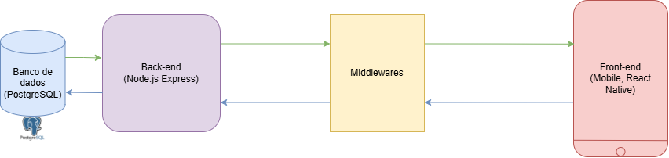

## 2.2 Detalhamento da Arquitetura

### 2.2.1 Detalhamento

A plataforma Aton é estruturada em uma arquitetura de **Cliente-Servidor**. Esta estrutura separa as responsabilidades em duas aplicações distintas: um **aplicativo móvel** (o cliente) e uma **API central** (o servidor). O código-fonte de ambas as aplicações é gerenciado de forma coesa dentro de um monorepo, utilizando _Turborepo e pnpm_ para otimizar o desenvolvimento e as dependências.

O **Cliente** da plataforma é o **aplicativo móvel**, desenvolvido em _React Native_ com o ecossistema _Expo_. Esta camada é exclusivamente responsável pela **apresentação e pela interação com o usuário**. Sua função é **renderizar** a interface, **capturar entradas** (como formulários de login ou cadastro) e **formatar essas informações** para envio. O Front-end não contém lógica de negócio; ele funciona como um consumidor que **apenas solicita e exibe dados**, comunicando-se com o servidor através de requisições **HTTP (API REST)**.

O **Servidor**, que atua como o **cérebro central** da arquitetura, é uma **API RESTful** construída em _Node.js e Express_. Esta camada de aplicação é onde reside toda a **lógica de negócio** do Aton. Ela é responsável por receber as **requisições HTTP** do cliente móvel, **processar** as operações (como autenticar um usuário, criar um campeonato ou buscar notícias) e **orquestrar** o acesso aos dados.

A comunicação entre o cliente e os serviços de negócio do Back-end é protegida por uma camada de **_Middlewares_** do _Express_. Esta camada funciona como um "guardião" que **intercepta cada requisição**. Suas responsabilidades são cruciais para a segurança e integridade dos dados: ela realiza a **autenticação** (verificando tokens JWT para proteger rotas) e a **validação** (garantindo que os dados enviados, como um e-mail ou senha, estejam no formato correto), antes que a requisição seja processada pela **lógica de negócio principal**.

No nível mais fundamental da arquitetura está a **camada de persistência**, composta por um banco de dados relacional _PostgreSQL_. Este banco armazena todos os dados (usuários, partidas, postagens) da plataforma Aton em diferentes tabelas. O **Back-end** (especificamente, sua camada de repositório) é o único componente com permissão para se **comunicar** com o banco de dados. Essa separação garante que o acesso aos dados seja sempre mediado pela lógica de negócio e pelas regras de segurança da API.

### 2.2.2 Intanciação dos componentes

O Diagrama esquemático acima ilustra a arquitetura de **Cliente-Servidor** instanciada, mostrando o fluxo de comunicação entre as três camadas principais (Apresentação, Aplicação e Persistência) e seus componentes tecnológicos específicos.

---

#### 2.2.2.1 Elementos de Arquitetura

#### 1. Camada Apresentação (Front-end)

#### Componente React Native

- **Tecnologia:** JavaScript/TypeScript
- **Responsabilidade:** Interface do usuário; exibição de posts, eventos e notificações.

#### 2. Camada Aplicação (Back-end)

#### Componente Express Controllers

- **Tecnologia:** Node.js / Express
- **Responsabilidade:** Receber requisições HTTP e direcionar para os serviços.

#### Componente Services (Regra de Negócio)

- **Tecnologia:** Node.js / Express
- **Responsabilidade:** Implementar lógica de negócio: login, eventos, postagens, curtidas e notificações.

#### Componente "Middleware (Auth, ErrorHandler)"

- **Tecnologia:** Node.js / Express
- **Responsabilidade:** Validação de tokens JWT (segurança) e tratamento centralizado de erros.

#### 3. Camada Persistência

#### Componente Prisma ORM

- **Tecnologia:** ORM (Object-Relational Mapping)
- **Responsabilidade:** Comunicação com o banco de dados PostgreSQL.

#### Componente PostgreSQL

- **Tecnologia:** Banco de Dados Relacional
- **Responsabilidade:** Armazenar dados persistentes: usuários, postagens, eventos, curtidas, seguidores e notificações.

---

#### 2.2.2.2 Protocolos:

#### 1. Protocolo de Comunicação Cliente-Servidor

O protocolo primário que governa a troca de dados entre o aplicativo móvel (**Cliente**) e a API central (**Servidor**) é:

- **HTTP (Hypertext Transfer Protocol) / API RESTful:**
  - O cliente se comunica com o servidor por meio de **requisições HTTP**.
  - O servidor segue o padrão arquitetural **REST (Representational State Transfer)**, utilizando **métodos HTTP padrão** (como `GET`, `POST`, `PUT`, `DELETE`) para interagir com recursos (como usuários, postagens ou eventos).

#### 2. Protocolo de Segurança e Autenticação

Para garantir que apenas usuários autorizados acessem rotas protegidas, o protocolo utilizado é:

- **JWT (JSON Web Tokens):** Este é o protocolo de **autenticação** e **autorização** utilizado.
  - **Fluxo:**
    1. Após o login, o servidor gera um **token JWT** e o envia ao cliente.
    2. Em requisições subsequentes a rotas protegidas, o cliente envia esse token.
    3. O **Middleware do Express** verifica o token JWT para confirmar a identidade e as permissões do usuário antes que a lógica de negócio seja processada.

#### 3. Protocolo de Persistência (Comunicação com o Banco de Dados)

O Back-end utiliza uma camada de abstração para se comunicar com o banco de dados relacional:

- **SQL (Structured Query Language):**
  - Embora não seja visível para o Front-end, o **PostgreSQL** usa SQL para manipular os dados (armazenar, buscar, atualizar).
- **Prisma ORM (Object-Relational Mapping):**
  - Esta é a **ferramenta/camada** que o Back-end utiliza para traduzir as operações da lógica de negócio em **comandos SQL** que o PostgreSQL entende. Ele atua como o mediador do protocolo de persistência.

#### Exemplo de Protocolos da API (Rotas e Permissões)

| Método | Rota               | Descrição                      | Permissões  |
| :----- | :----------------- | :----------------------------- | :---------- |
| POST   | `/users`           | Cadastro de novo usuário       | Público     |
| DELETE | `/users/:username` | Deleta usuário                 | Autenticado |
| GET    | `/users/:username` | Busca um usuário pelo username | Público     |
| POST   | `/posts`           | Criar nova postagem            | Atléticas   |
