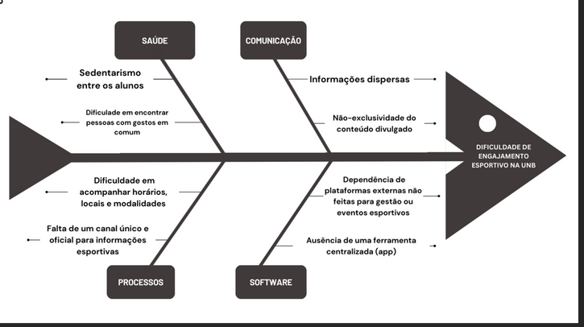

# VISÃO GERAL DO PRODUTO 

## Problema

O sedentarismo no meio acadêmico é um problema significativo, associado a altas taxas de inatividade física entre estudantes universitários, o que pode levar a problemas de saúde física e mental, como estresse e ansiedade, e impactar negativamente o desempenho acadêmico. Como forma a combater este problema de saúde pública existem diversas atléticas que promovem a prática de esportes e eventos de integralização para os estudantes além das organizações de equipes amadoras em determinados esportes.  

Atualmente na Universidade de Brasília, as atléticas promovem eventos, amistosos e campeonatos e os divulgam em redes sociais como Instagram e Telegram, porém para os alunos saberem o que está sendo ofertado além do local, dia e hora é necessário estar seguindo as atléticas nestas redes sociais, o que pode ser um problema por falta de divulgação dos perfis, a não-exclusividade e descentralização do conteúdo. 

{ width="700" }

## Solução

Neste contexto, visando a promoção, divulgação e incentivo à estas práticas esportivas vê-se necessário a centralização de divulgação de ações esportivas em um só lugar por meio de um aplicativo que promova essa divulgação, além do incentivo por meio de interações de usuários para cada ação, além de permitir a criação de grupos que compartilham os mesmos gostos de modalidades, esse objetivo será alcançado através do `Aton`.

## Declaração de Posição do Produto 

| Categoria | Descrição |
| :--- | :--- |
| **Para:** | Alunos, Atléticas e equipes amadoras da UnB |
| **Necessidade:** | Centralizar e unificar as informações de eventos esportivos da UnB |
| **O Aton:** | É um App mobile |
| **Que:** | Possui o benefício de facilitar e incentivar a criação e a participação dos alunos da UnB em eventos esportivos oficiais e amadores, incentivando a saúde e o lazer dos participantes. |
| **Ao contrário:** | Caso o app não seja implementado, as principais informações sobre os eventos esportivos da UnB irão permanecer espalhadas por diferentes redes sociais, descentralizando a informação e dificultando o acesso de possíveis participantes. |
| **Nosso produto:** | Irá permitir a centralização do conteúdo de maneira simples, facilitando o acesso e a busca dos usuários. |                                                     |

## Objetivos do Produto

### Objetivo principal

Promover a integração da comunidade universitária por meio do esporte e do lazer bem como incentivar ações voltadas a saúde através do esporte;

### Objetivos secundários

- Facilitar a divulgação de eventos promovidos pelas atléticas da UnB. 
- Notificar usuários sobre os eventos segundo suas preferências.

## Tecnologias a Serem Utilizadas

### Linguagens: 

- Typescript/Javascript; 
- Tsx/Jsx; 

### Ferramentas: 

- Git & Github; 
- Whatsapp; 
- Teams; 
- Outlook; 
- Notion; 
- SonarQube; 
- Figma;

### Plataformas:
- Android;
- iOS;
- Web (Talvez no futuro).

### Frameworks:

- ScrumXP (adaptado);
- React Native; 
- Expo;
- Node JS; 
- Jest; 
- ExpressJS
