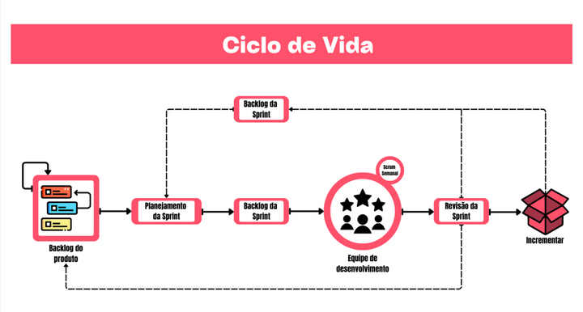

# VISÃO GERAL DO PROJETO

## Ciclo de vida do projeto de desenvolvimento de software

{ width="700" }

A imagem do ciclo de vida acima, demonstra um fluxo Scrum modificado com: _Backlog do produto_ → _Planejamento da Sprint_ → _Backlog da Sprint_ → _Equipe de Desenvolvimento (com Scrum semanal)_ → _Revisão da Sprint_ → _Incremento_, com um retorno ao Backlog do produto para refinamento.

Justificativas:

-   Entregas contínuas de valor através de sprints semanais que permitem validar funcionalidades junto ao usuário em tempo real.
-   Feedback rápido com revisões de sprints e laços de retorno mantendo o produto alinhado as necessidades dos usuários e clientes.
-   Gerenciamento de incertezas para testar hipóteses e manter a qualidade do produto.
-   Transparência e visibilidade do progresso a partir de um Backlog visível e quadro de sprints, deixando claro o que está feito, em progresso ou bloqueado.
-   Priorização orientada a valor percebido com base em métricas e feedbacks junto do PO, diminuindo a dependência de suposições.

## Organização do Projeto

| Papel | Atribuições | Responsável | Participantes |
| --- | --- | --- | --- |
| Desenvolvedor | Codificar o produto, codificar testes unitários, realizar refatoração | Todos da equipe |  |
| Dono do Produto | Atualizar o escopo do produto, organizar o escopo das sprints, validar as entregas | Rodrigo |  |
| Analista de Qualidade | Garantir a qualidade do produto, garantir o cumprimento do conceito de pronto, realizar inspeções de código | Ângelo, Gabriel Mota |  |
| Cliente | Validar se o produto atende às necessidades, fornecer feedback contínuo, priorizar requisitos e aprovar entregas | Pedro Inacio, Samuel | Pedro Barbosa (Integrante da atlética) |

## Planejamento das Fases e/ou Iterações do Projeto

atualizado de maneira sucessiva, a partir da realização de cada ciclo (sprint, iteração)

| Sprint | Produto (Entrega) | Data Início | Data Fim | Entregável(eis) | Responsáveis | % conclusão |
| --- | --- | --- | --- | --- | --- | --- |
| *Sprint 0* | Planejamento inicial do produto e projeto  | 15/09/2025 | 22/09/2025 | Parte da Documentação de visão do produto e projeto | Todos os membros | 0% |
| *Sprint 1* | Concepção do Backlog/ Início de prototipação  | 22/09/2025 | 29/09/2025 | Backlog, Protótipo de alta fidelidade e documento de visão completo | Todos os membros + Clientes | 0% |

(\*): Podem ser apelidos (Aliases), desde que existam suas definições completas, após o quadro.

## Matriz de Comunicação

| Descrição | Área/Envolvidos | Periodicidade | Produtos gerados |
| --- | --- | --- | --- |
- **Acompanhamento das Atividades em Andamento**  - **Acompanhamento dos Riscos, Compromissos, Ações Pendentes**, Indicadores | Equipe do Projeto  | Semanal | Relatório de situação do projeto  |
|     Comunicar situação do projeto  | - **Equipe do projeto**    - **Monitor**    - **Cliente**  |  quinzenal  | - Ata de reunião  - Relatório de situação do projeto  - Aprovação de entregas |

### Gerenciamento de Riscos
| Risco | Categoria | Grau de exposição (Baixo/Médio/Alto) | Fonte/Origem | Descrição e Impacto | Ação de Mitigação/Plano de Contingencia | 
|---|---|---|---|---|---|
| Atrasos | Cronograma | Baixo |Escopo mau dimensionado ou alteração no plano da disciplina | Imprevistos que comprometam o cronograma de releases do projeto | Realizar Sprint Review e verificações constantes do backlog do produto |
| Mudanças de funções | Equipe | Baixo | Capacitação técnica insuficiente para a atividade | Alteração de responsabilidades ou funções entre membros de equipe | Manter comunicação direta e transparente quando distribuir atividades para os membros, a fim de equiparar a Task com a capacidade de execução do membro |
| Desalinhamento/Conflito | Equipe | Baixo |Comunicação ineficiente | Impacto negativo no clima organizacional | Manter a proatividade em ajudar os demais integrantes. Realizar comunicações oficiais em canais validados|
| Mudança de escopo | Escopo | Baixo |Alteração no Backlog | Pode impactar nos prazos ou na realização de múltiplas tasks ao mesmo tempo pela equipe | Comunicar intenção de escolhas de tasks na sprint review prescedente|
| Falta ou indisponibilidade de algum membro | Equipe | Médio | Doença/Provas |Sobrecarga de outros membros | Trabalhos realizados em duplas para que haja a continuidade da execução|
| Incompatibilidade de stack | Ferramentas | Médio | Ambientes de desenvolvimento diversos |Pode haver bugs no software | Estruturar corretamente o documento de arquitetura e seguir as diretrizes à risca |

### Critérios de Replanejamento

| Critério | Ação |
| --- | --- |
| Atrasos | Caso surjam imprevistos que comprometam o cronograma, faremos uma análise para ajustar as datas de entrega, garantindo que permaneçam viáveis.|
| Mudança de funções entre os membros | Se as responsabilidades da equipe mudarem, vamos dar prioridade a registrar tudo em detalhes, capacitar todos com diversas habilidades, manter a comunicação transparente e nos adaptar rapidamente aos novos planos.
| Mudanças significativas no escopo | Caso o escopo sofra mudanças significativas que venham a afetar os objetivos, os resultados esperados ou os recursos alocados, o plano de contingência (definir um de acordo com o gerenciamento de riscos) será colocado em prática e deverá ser reavaliado, visando ajustar o projeto às novas orientações.
| Novos requisitos para o projeto | É essencial examinar com atenção as demandas adicionais, mantendo um diálogo aberto com o time para entender o impacto sobre as necessidades já existentes, e ordenar as novas prioridades conforme a importância e a premência. Será preciso, ainda, ajustar o planejamento do projeto para incorporar essas modificações.
| Desentendimento entre os membros da equipe | É fundamental reavaliar algumas partes do projeto, uma vez que pode haver a necessidade de dividir os integrantes da equipe que estavam trabalhando juntos ou reestruturar determinadas seções do produto. Caso ocorra alguma divergência, o conflito será abordado com o objetivo de solucioná-lo empregando o método de Comunicação Não Violenta (abordagem desenvolvida pelo psicólogo Marshall Rosenberg para criar conexões autênticas e resolver conflitos através da empatia e do respeito).
